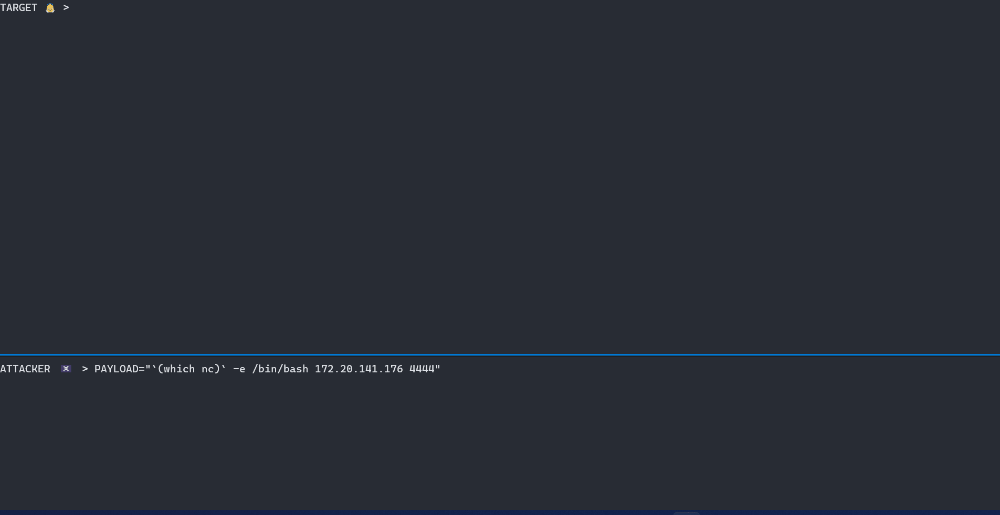

<div align=center>

<sup>*<i>«shuid» stands for shadow SUID file</i></sup>
<pre><code><strong>Privileged persistence 
<br>without using noisy and detectable SUID 
<br>using <i>binfmt</i> Kernel feature instead</strong>
Also a good way to learn Nim and something new
</code></pre>
</div>

|👁️ Persistence demo|
|:---:| 
||

## Like at home! 🏡 <sup>(persistence)</sup>

* Build `shuid` (needs `gcc` & `nim`):<br><pre><code>./build.sh [PERISTENCE_CMD] [RULE_NAME]</code></pre>

* Transfer it on target
* Run it!<br><pre><code>sudo ./shuid</code></pre>

And that's all, you are under the radar. The process to obtain root shell will be outputted 

##### More granular

You have other possibilitles to sharpen the exploit. For example you can choose which SUID will hide your "shuid file" (*aka interpreter*).
An example:
```shell
sudo ./shuid --file "/path/to/suid/file"
```

## Road to root! 🛣 <sup>(privesc)</sup>

Under certain circumstances, the trick can be used to gain elevated privileged. You can test it with:

```shell
./shuid --privesc
```

## [Understand the trick](TRICK.md)


<div align=center>
<sup>
All credits goes to <a href= https://github.com/Sentinel-One/shadowsuid/>Dor Dankner</a>, <a href= https://github.com/toffan/binfmt_misc>toffan</a> and <a href= https://www.hackthebox.com/home/users/profile/590762>uco2KFH</a> 
</sup>
</div>
